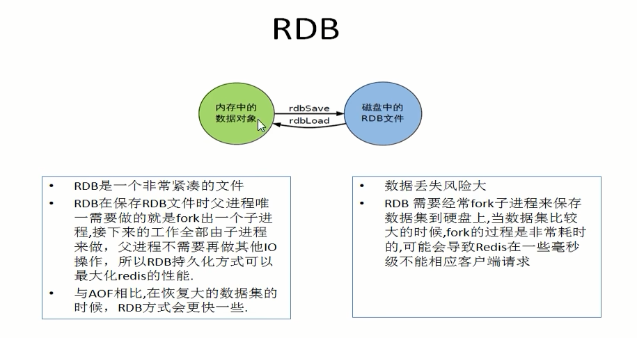

# RDB快照文件.md

### 如何检查修复dump.rdb文件？

进入到redis安装目录，执行redis-check-rdb命令 redis-check-rdb ./redisconfig/dump.rdb

### 哪些情况会触发RDB快照

1. 配置文件中默认的快照配置
2. 手动save/bgsave命令
3. 执行flushdb/fulshall命令也会产生dump.rdb文件，但是也会将命令记录到dump.rdb文件中，恢复后依旧是空，无意义
4. 执行shutdown且没有设置开启AOF持久化
5. 主从复制时，主节点自动触发

### 如何禁用快照

1. 动态所有停止RDB保存规则的方法：redis-cli config set value ""
2. 手动修改配置文件

### RDB优化配置项详解

配置文件SNAPSHOTTING模块

- save \<seconds> \<changes>：配置快照保存条件

- dir：配置快照保存目录地址

- dbfilename：配置快照的文件名

- stop-writes-on-bgsave-error：

  

  默认yes，如果配置成no，表示不在乎数据不一致或者有其他的手段发现和控制这种不一致，那么在快照写入失败时，也能确保redis继续接受新的请求

- rdbcompression：

  

  默认yes，对于存储到磁盘中的快照，可以设置是否进行压缩存储。如果是的话，Redis会采用LZF算法进行压缩。如果你不想消耗CPU来进行压缩的话，可以设置为关闭此功能

- rdbchecksum：

  

  默认yes，在存储快照后，还可以让redis使用CRC64算法来进行数据校验，但是这样做会增加大约10%的性能消耗，如果希望获取到最大的性能提升，可以关闭此功能

- rdb-del-sync-files：

在没有持久化的情况下删除复制中使用的RDB文件。默认情况下no，此选项是禁用的。

小总结：

